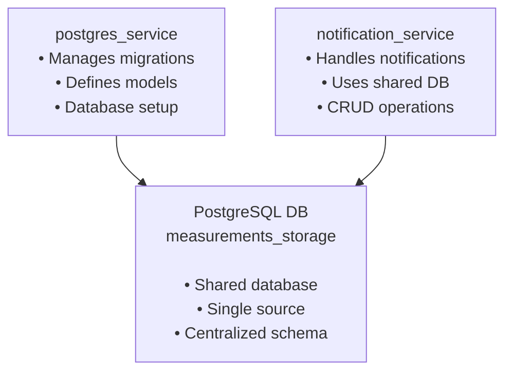

# GORM PostgreSQL Multi-Service Architecture

This project demonstrates a microservices architecture using GORM with PostgreSQL, where database migrations and model management are centralized in one service while other services connect to the same database.

## Architecture Overview



## Services

### 1. postgres_service
- **Purpose**: Database management and schema migrations
- **Responsibilities**:
  - Running database migrations
  - Defining and maintaining data models
  - Database initialization
  - Schema management

### 2. notification_service
- **Purpose**: Notification handling and delivery
- **Responsibilities**:
  - Creating notifications
  - Sending notifications (email, SMS, push)
  - Managing notification templates
  - Notification status tracking

## Legacy Services

### Consumer Service
- Token-based authentication for notification service
- Temperature endpoint on port 3003 (FastAPI)

#### Building and Running the Consumer
```bash
# Build the image
docker build -t client -f ./consumer/Dockerfile .

# Create the network
docker network create measurement-network
```

## Key Features

✅ **Centralized Migration Management**: All database schema changes are managed by postgres_service  
✅ **Shared Database**: Multiple services connect to the same PostgreSQL instance  
✅ **Service Independence**: Each service can be developed and deployed independently  
✅ **GORM Integration**: Full GORM ORM capabilities across all services  
✅ **Docker Support**: Complete containerization with Docker Compose  
✅ **Health Checks**: Service dependency management with health checks  

## Quick Start

### Using Docker Compose (Recommended)

1. **Start all services:**
   ```bash
   docker-compose up --build
   ```

   This will:
   - Start PostgreSQL container
   - Run postgres_service (handles migrations)
   - Start notification_service (connects to existing DB)

2. **View logs:**
   ```bash
   docker-compose logs -f
   ```

### Local Development

1. **Start PostgreSQL:**
   ```bash
   docker run --name postgres_local \
     -e POSTGRES_USER=postgres \
     -e POSTGRES_PASSWORD=password \
     -e POSTGRES_DB=measurements_storage \
     -p 5432:5432 \
     -d postgres:15-alpine
   ```

2. **Run postgres_service (migrations):**
   ```bash
   cd postgres_service
   cp .env.example .env
   go mod tidy
   go run main.go -migrate
   ```

3. **Run notification_service:**
   ```bash
   cd notification_service
   cp .env.example .env
   go mod tidy
   go run main.go
   ```

## Database Schema

The shared database includes these main tables:

### Core Tables
- **users**: User information and profiles
- **posts**: Blog posts or content (example)
- **tags**: Tagging system with many-to-many relationships

### Notification Tables
- **notifications**: Individual notification records
- **notification_templates**: Reusable notification templates

### Relationships
- User → Notifications (One-to-Many)
- Post → User (Many-to-One)
- Post ↔ Tags (Many-to-Many)

## Configuration

Both services use environment variables for database configuration:

| Variable | Description | Default Value |
|----------|-------------|---------------|
| `DB_HOST` | Database host | `localhost` |
| `DB_PORT` | Database port | `5432` |
| `DB_USER` | Database user | `postgres` |
| `DB_PASSWORD` | Database password | `password` |
| `DB_NAME` | Database name | `measurements_storage` |
| `DB_SSL_MODE` | SSL mode | `disable` |

## Resources

- [GORM Documentation](https://gorm.io/docs/)
- [PostgreSQL Documentation](https://www.postgresql.org/docs/)
- [Docker Compose Documentation](https://docs.docker.com/compose/)
`docker network create producer`

#### 3. Run this line to start the consumer
`docker run --rm --name client --network producer --volume $(pwd)/auth:/usr/src/app/auth client group2 group2-group`

#### 4. Run the test producer
`docker run --rm --name producer -v ./auth:/experiment-producer/auth -v ./loads/2.json:/config.json -it --network producer dclandau/cec-experiment-producer -b kafka1.dlandau.nl:19092 --config-file /config.json --topic group2`